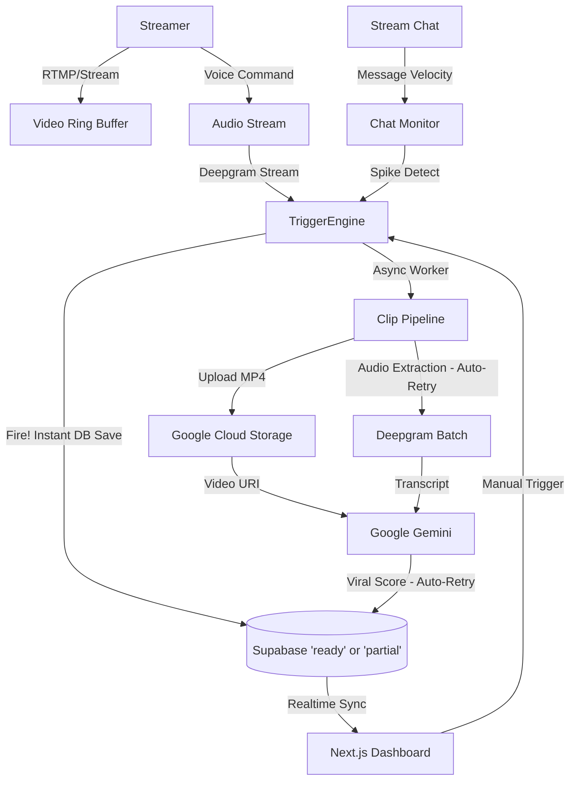

# Klair - AI-Powered Automated Virality for Streamers

> An AI-native live stream monitor that detects, clips, and analyzes viral moments in real-time, turning hours of footage into shareable content instantly.

---

## 🎥 Demo

Try out Klair here -> [https://klair.live/](https://klair.live/)

<video src="https://github.com/user-attachments/assets/466ebf5f-6a76-41d9-a23e-dcbbf1e770fd" controls="controls" muted="muted" playsinline="playsinline" width="100%"></video>

*watch how Klair captures live moments instantly*

---

## 🧠 The Product Thinking

### The Problem
Live streaming is a booming economy, but the monetization workflow is broken. A creator might stream for 8 hours, but the "viral" moments that drive channel growth (and revenue) often get lost in the noise. Finding, clipping, and formatting these moments manually costs hours of unbillable labor. For a solo creator business, missing these clips means missing out on the discoverability that drives sponsorships and ad revenue.

### The Solution
**Klair** acts as an always-on AI producer. It watches the stream so you don't have to.
#### 1. Context-Aware AI Analysis
It sends the clip to **Google Gemini** to analyze *why* it's funny or exciting. It assigns a "Viral Score" (0-100) based on visual and audio cues, and auto-generates titles, hashtags, and descriptions.
<video src="https://github.com/user-attachments/assets/2cdbae88-1854-4b5a-bfab-e5855fdd7703" controls="controls" muted="muted" playsinline="playsinline" width="100%"></video>

#### 2. Transcript-Based Navigation/Editing

Video editing is tedious. Klair converts the stream into an interactive transcript. Click a word to jump instantly to that timestamp—making clip refinement 10x faster than traditional scrubbing.

<video src="https://github.com/user-attachments/assets/6b74dc7b-2f99-4969-926a-bfdf94c587a3" controls="controls" muted="muted" playsinline="playsinline" width="100%"></video>

<video src="https://github.com/user-attachments/assets/b306cbe8-6f3c-4867-b599-ad5c35d7380a" controls="controls" muted="muted" playsinline="playsinline" width="100%"></video>

#### 3. Smart Triggers & Instant Context
It listens for your voice commands ("Klair, clip that!") and monitors chat velocity (e.g., a spike in "LUL" or "OMG") to identify high-potential moments *as they happen*, capturing the seconds *before* the trigger to ensure the perfect cut.

### Target User
*   **Creator Entrepreneurs (Twitch/YouTube/Tiktok/etc)** Solopreneurs who need to scale their content output to compete with larger channels.
*   **Content Agencies** Teams managing portfolios of creators who need to automate the manual "sifting" process to increase margins.
*   **Esports Organizations** looking to capture highlights automatically.

---

## 🛠️ The AI-Native Builder

### Architecture

### Technical Challenges

**1. Latency-Critical Ring Buffer State**
One of the hardest challenges was managing a continuous sliding window of video memory (Ring Buffer) that could be "locked" instantly. 
*   *Solution:* I implemented a custom `VideoBuffer` using `ffmpeg` pipes that constantly rewrites a temporary stream. When a trigger fires, we seamlessly stitch the "Pre-Buffer" (default: past 30s) with the "Post-Delay" (default: next 10s) without dropping frames, handling the async IO overlap to ensure the recorder never blocks the main detection loop.

**2. Dual-Modal Trigger Synchronization**
Coordinating wake-word detection (Voice) with Chat Velocity (Text) required finding a balance to avoid duplicate clips.
*   *Solution:* I built a centralized `ClipEngine` with a thread-safe `clip_lock` and specific "cooldowns." If the chat spikes *because* the streamer yelled a command, Klair is smart enough to treat it as a single high-confidence event rather than two separate weak ones.

**3. Context-Aware AI Scoring & Auto-Recovery**
Raw video isn't enough for a model to understand "humor," and third-party APIs (Gemini/Deepgram) fail often during heavy loads.
*   *Solution:* We feed Gemini a multi-modal prompt (Video + Transcript). Crucially, the entire pipeline is built on a **Save-First State Machine**. Clips instantly hit the DB as `processing`. If any external API fails after 3 automated retries, the clip gracefully degrades to a `partial` state inside a "Needs Retry" UI, ensuring the creator never loses raw footage to network timeouts.

### Next Steps / Roadmap

*   **⚡ Async Pipeline & Connection Pooling:** Update the ThreadPoolExecutor to `asyncio.gather()` to parallelize GCS and Gemini uploads, and reuse client connections to halve processing time.
*   **🏢 Scalable Split-Worker Architecture:** Decouple the FastAPI recording loop from the heavy video pipeline using a Message Queue (Celery/Redis), allowing 100+ concurrent users to trigger clips without dropping stream frames.
*   **🌐 Multi-Platform Publishing:** One-click integration to post high-scoring clips directly to TikTok/Instagram/YouTube Shorts.
*   **⚡ Auto-Edit for Vertical (9:16):** Use AI facial detection to automatically crop landscape frames into vertical clips for TikTok/Reels, keeping the streamer and gameplay in focus.
*   **🤖 Personalized AI Models:** Fine-tune the "Viral Score" based on the creator's *past* successful clips, rather than a generic baseline.

## ⚖️ License & Community
* **License:** Distributed under the CC-BY-NC 4.0 License. See `LICENSE` for more information.
* **Community:** We are committed to a welcoming and inclusive environment. Please read our `CODE_OF_CONDUCT.md` before contributing.
